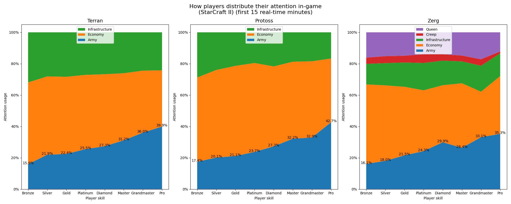

# Player attention spending in StarCraft II

This explores how players distribute their attention in-game, and how that changes across skill levels.

Result:

# Methods

Data obtained from ~3000 1v1 replays from ladder and tournaments (professional category).

The code uses modified version of https://github.com/ZephyrBlu/selection-analysis. 
It tracks which units are selected, and then divide them into predefined categories:

* Economy is comprised of command structures (Nexus, CC, Hatchery, etc) and workers.
* Infrastructure is comprised of all other buildings.
* Creep Spread (Zerg only)
* Queens (Zerg only)
* Army

# Observations
1. There is a significant decrease of time spent on army as we go to lower leagues. Observing this was the goal of this work. The difference is around 2.5x more time spent on army between professional and bronze players.
2. Creep spread and Queen usage seems mostly stable across levels, only professional players seem to have optimized this a bit more. However, Zerg classification is more difficult with larvae and eggs being used broadly, or Queens spreading creep. So I wouldn't focus on the Zerg data too much.
3. Unit selections are only counted for the first 15 real-time minutes. This is to keep games more comparable to each other, as there is a dependecy of game-length. Longer games will have higher share of army focus (+1-3% when without a limit), and shorter games will have higher economy focus (-3% army focus when limited to the first 10 minutes). 15 real-time minutes is a typical StarCraft II game length.